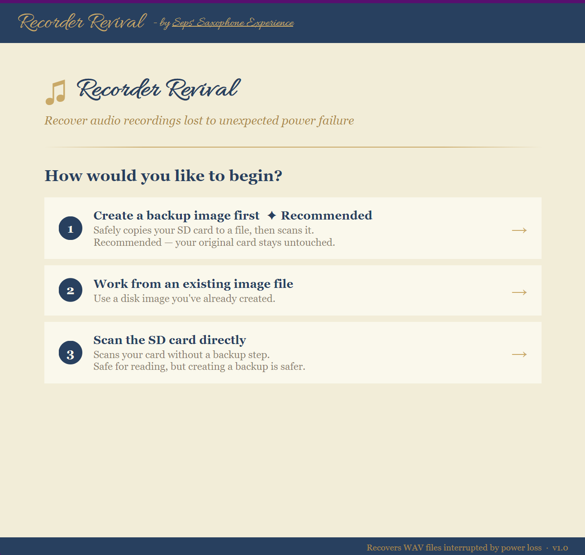
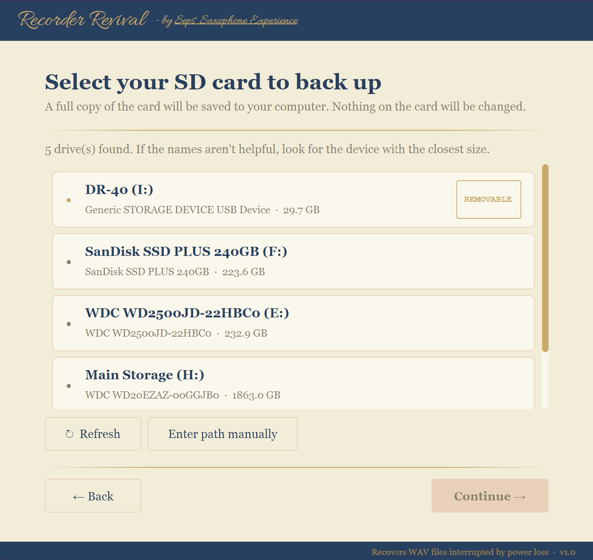
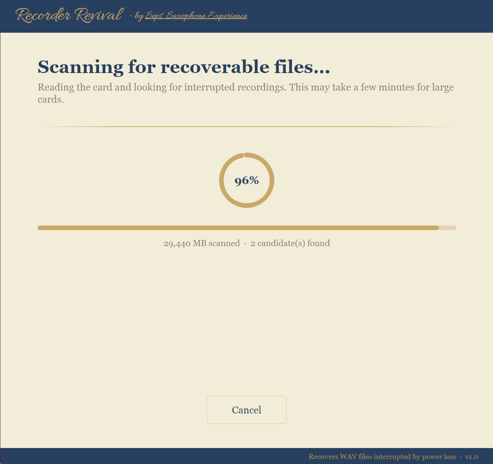
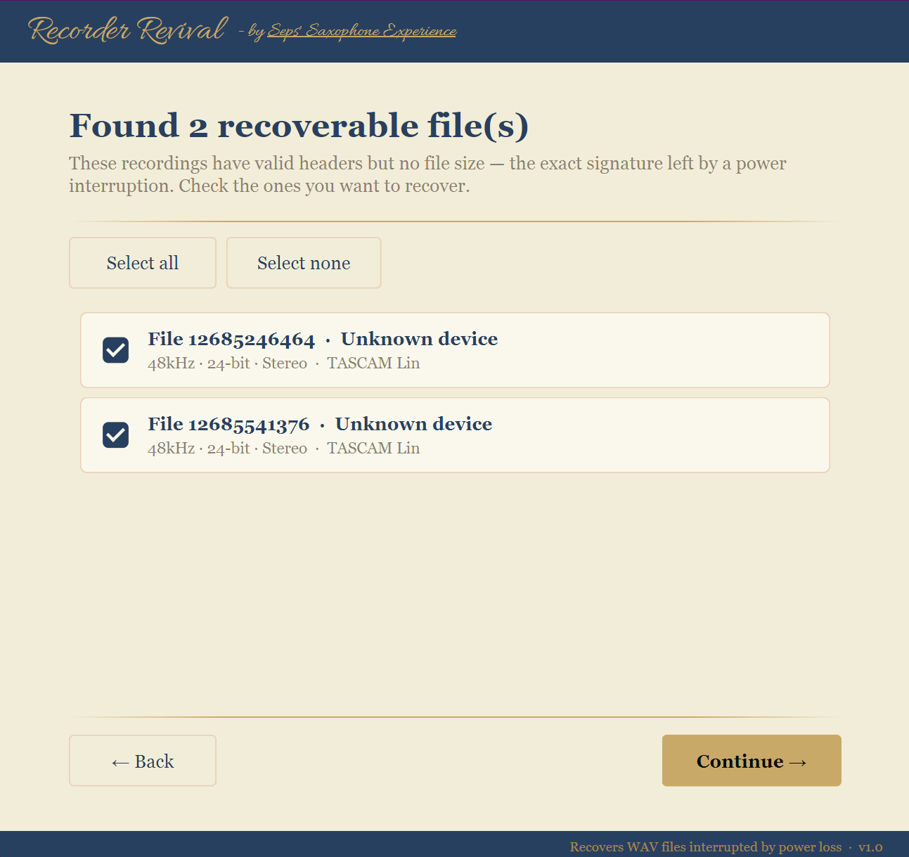

# Recorder Revival

Recovers 0kb audio files from SD cards after unexpected power loss.

Recorder Revival is a simple, cross-platform tool designed to help you recover recordings from SD cards used in devices like handheld recorders that were interrupted mid-write (dead battery, accidental shutdown, etc.).

DISCLAIMER: WILL NOT WORK ON VERY SHORT RECORDINGS ( > ~5 minutes ). You can still try, but if it fails, seek professional data recovery help.

---

## 🎯 What it does

When a recording device loses power, audio files may not finalize properly — making them unreadable even though the data still exists.

Recorder Revival:
- Scans raw SD card data
- Detects and reconstructs recoverable audio files
- Saves them to your computer for use

---

## 🧰 Features

- ✔️ Designed specifically for audio recovery
- ✔️ Works with SD cards and disk images
- ✔️ Simple, guided interface
- ✔️ No coding or dependencies required
- ✔️ Available for Windows, macOS, and Linux

---

## 🚀 Getting Started

1. [Download Latest Release](https://github.com/TylerSeppala/Recorder_Revival/releases/latest)
2. Follow installation steps for your OS (at release link)
3. Launch Recorder Revival
4. Follow the on-screen steps

---

## ⚠️ Important Notes

To keep it free, this app is not yet code-signed. Windows/Mac may show a warning like:

> "Windows protected your PC"

This is expected.

To proceed (Windows):
1. Click **More info**
2. Click **Run anyway**

To proceed (Mac):
1. Right-click
2. Click **Run**

---

## 💡 Tips for best results

- Stop using the SD card immediately after failure  
- Do not record new audio to the card before recovery  
- Use the first option to create a disk image rather than recovering directly from the card  
- Larger cards may take longer to scan  

---

## ❓ If something doesn’t work

Recovery can depend heavily on how the device failed.

If you’re stuck:
- Open an issue on this repository  
- Or send a message with details about your device and situation  

---

## ☕ Support

If this tool helped you recover important audio, you can support development here:

👉 https://ko-fi.com/sepssax

---

## 📌 Disclaimer

Recovery is not guaranteed in all cases.  
Always keep backups of important recordings when possible.

---

## 📷 Screenshots

---

## 🛠️ Built With

- Python
- PyQt6
- A lot of trial, error, and late nights
